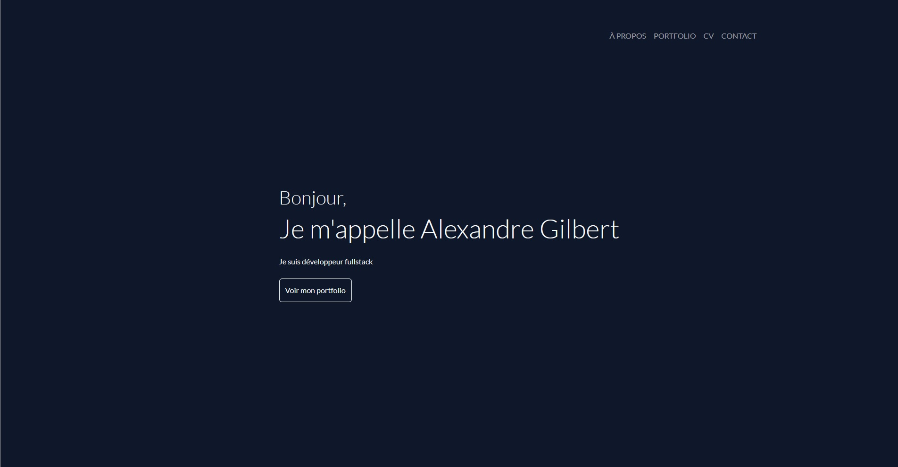
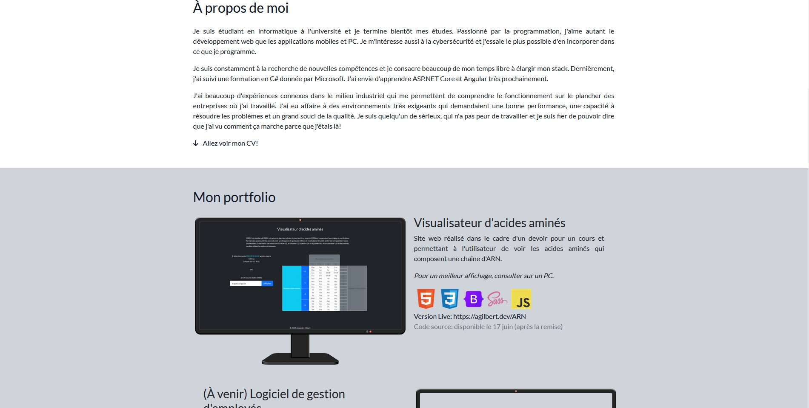
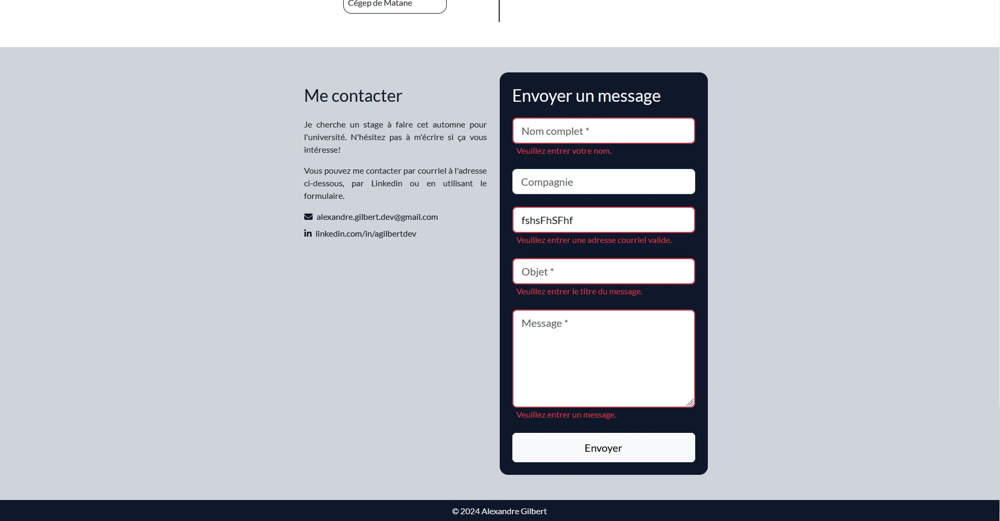
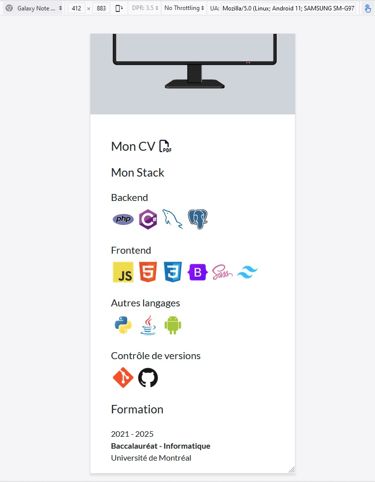

<h2>Portfolio</h2>

This is the landing page for my portfolio website. Developed using PHP.

<a href='https://agilbert.dev'>https://agilbert.dev</a>  

The layout was done using Bootsrap's grid system.

Form validation is all done via PHP for added security, because it's easy for users to modify html code in order to remove Javascript form validation and submit whatever they want, including malicious code.

To prevent code injection inside the form, the program also transforms each user input into html entities before processing it.

Finally, I made sure the page was mobile friendly.

